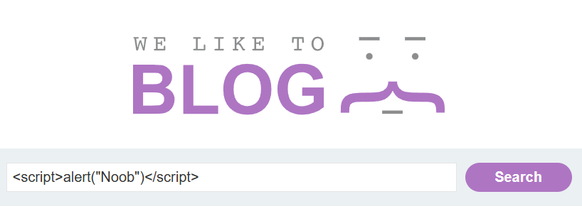
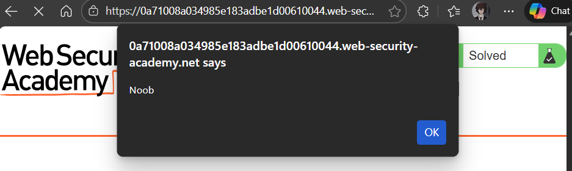

# Lab 1 :

This lab i need to show that there is a `Reflected XSS` vuln in the search functionality using the alert function 

**Recap [ Reflected XSS ] :** 

Reflected XSS occurs when user input is immediately returned in the server’s response without proper validation or encoding

**Example :**  It executes only when a victim clicks a specially crafted link containing the payload.

**Cause :** The application takes user input from the search parameter and directly includes it in the HTML response without sanitizing or encoding it. 

**Solution :**

Solved this by just executing this script in the seach area .

```
<script>alert("Noob")</script>
```





---

---
