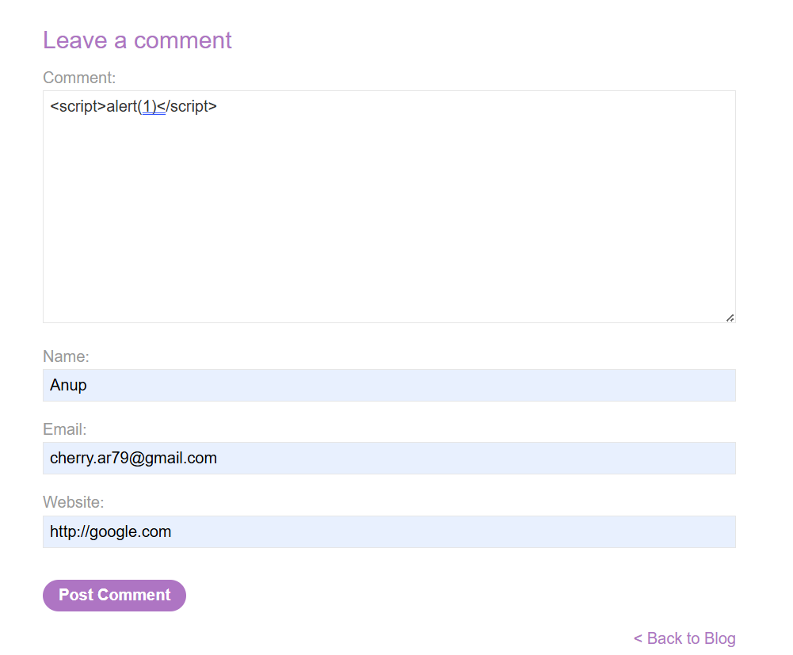
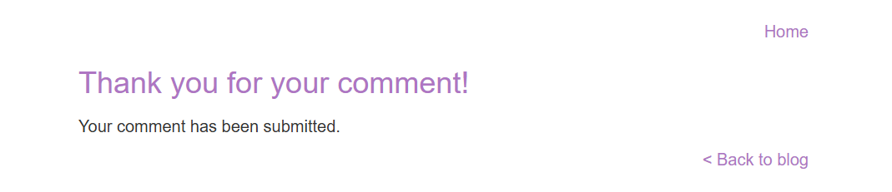
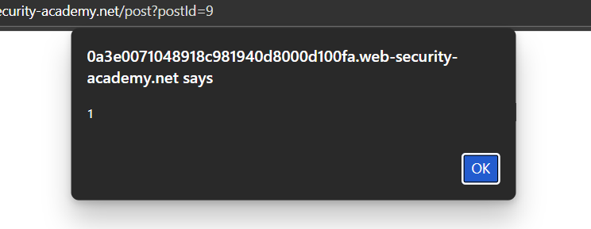
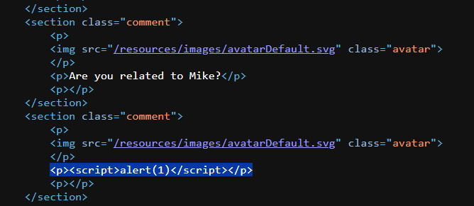

# Lab 2: Stored XSS in Blog Comment Functionality

### 🚩 Vulnerability Overview  
This lab demonstrates how a blog application is vulnerable to **Stored XSS**, allowing malicious JavaScript to be permanently stored and executed in other users’ browsers.

### 📝 Recap [ Stored XSS ]  
Stored XSS occurs when malicious input is saved by the server and later executed in other users’ browsers when they view the affected content.

### 🔗 Example  
This typically occurs in places like comment sections, profile fields, or any input that gets stored in a database and displayed later.

### 🔍 Cause  
Persistent storage of unsanitized user input that is later returned in the HTTP response without output encoding.

### 🛠️ Solution  
Solved this lab by choosing any blog post and inserting the following payload into the comment section:

```
<script>alert(1)</script>
```
<br>

<br>

<br>

<br>

After submitting the comment, when navigating back to the blog post:

<br>

<br>

Every user who visits this post will see the alert box triggered automatically, meaning the malicious script executes in their browser as well:

<br>

<br>
